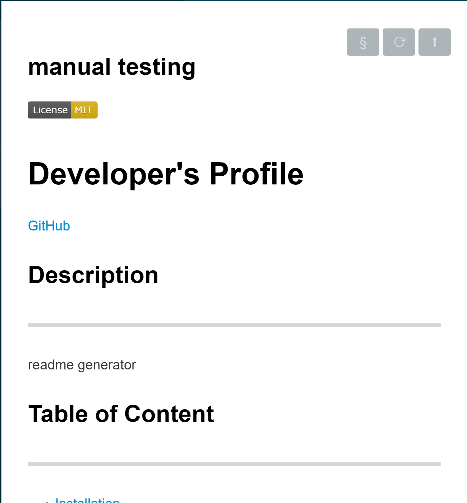
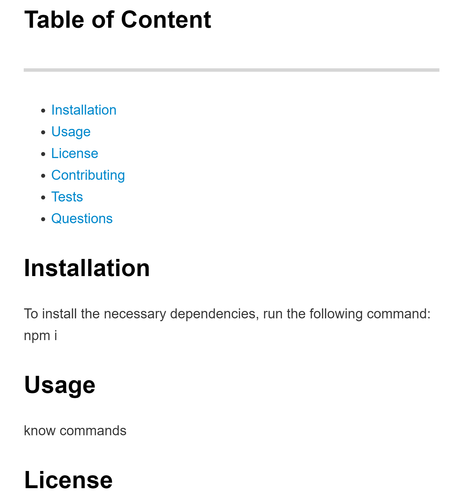
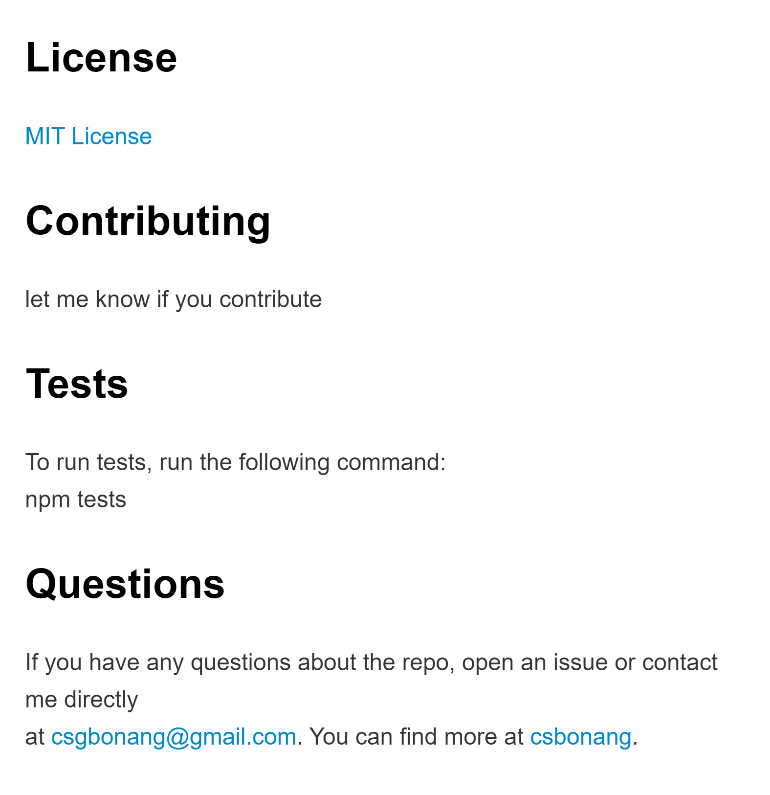

# bonang_README_Generator

<b>Programmer: Clarisse Bonang
Deployed link: 
</b>

## Description 
The following program prompts the user for information about the repository through the command-line. Then, the program generates a README with the following information: title of my project and sections entitled Description, table of contents, installation, usage, license, contributing, tests, and questions. 

## Screenshot 
Top:  
Middle: 
Bottom: 

## Example
Link to Video Example  
https://drive.google.com/file/d/1Y3k4FN4UXTQenMB_Wz5jvJ65RMtNIcz7/view?usp=sharing   

## References 
Markdown Guide   
https://guides.github.com/features/mastering-markdown/  
License/Badge   
https://gist.github.com/lukas-h/2a5d00690736b4c3a7ba   
Structure   
* referenced class notes 
